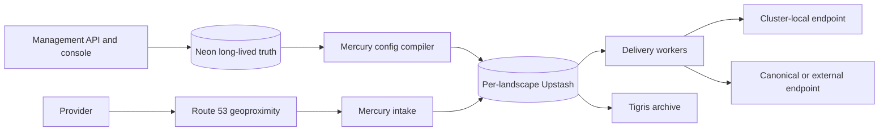

# Mercury

<!-- ### mercury -->
<!-- #### source: mercury -->

Mercury is AtomiCloud's fleet-wide, multi-tenant webhook product. It verifies
provider-native requests, atomically deduplicates and accepts them in the
landing landscape, acknowledges the provider, and asynchronously delivers a
freshly signed v1 envelope to every registered endpoint.

Its delivery contract is **at-least-once and unordered**. Deduplication is a
landscape-local optimization, so every consumer must be idempotent.

## Architecture



The fixed intake sequence is:

```text
land -> verify -> atomic dedup + persist + enqueue -> 200 -> deliver
```

Neon owns tenants, accounts, immutable home bindings, custom domains,
credential metadata, subscriptions, and quotas. Each serving landscape owns
retention-bounded events, dedup guards, queues, attempts, DLQs, counters, and
derived configuration in its own Upstash. Tigris receives month archives
before live streams are deleted.

T3 is only the internal-tenant management client: it merges CR registrations
and calls Mercury with the default internal account. Mercury alone compiles
and generation-swaps per-landscape Upstash configuration.

## Event and delivery guarantees

- Verification failure returns `401` and persists nothing; an unregistered
  path returns `404`.
- Acceptance is one failure-atomic operation: dedup guard, event, and every
  snapshotted endpoint obligation become visible together before `200`.
- A duplicate in the same landscape returns `200` without another event or
  obligation. A retry landing elsewhere can be accepted again.
- Every registered endpoint gets one independent obligation. Locality changes
  only the address selected for that obligation.
- Only exact `200` completes delivery. Retry, DLQ, circuit, and replay state is
  isolated per endpoint.

## Quickstart target

The local product stack is a Garden realization, not an in-process substitute.
Once that stack target lands, the intended workflow is:

```bash
pls up
MERCURY_SIT_BASE_URL=https://hooks.webhook.mercury.localhost \
MERCURY_SIT_CONTROL_URL=http://mercury-test-stack.mercury.svc.cluster.local \
bun run test:sit
```

The SIT suite requires a real injected stack and fails closed when its public
factory, dependency claims, Route 53 metadata, credentials, or provider
fixtures are missing. D21 remains open, so this does not authorize a Mercury
engine in hermetic rotom/absol. D7 remains open for preview consumption mode.
D11 only withholds preview callback delivery visibility.

## Configuration and security boundaries

- Tenant identity comes from registered path/state plus verified credentials,
  never from request `Host`, forwarded headers, source network, or payload
  business fields.
- Public and cluster-local paths run the same application code and enforce the
  same auth, quota, metering, and access-log behavior.
- Provider verifier material, tenant credentials, and internal delivery keys
  use Infisical to ExternalSecret delivery. Secret values never enter CRs or
  Upstash configuration.
- Credential rotation is dual-live. Verification and management auth accept
  the active and next generation through the overlap, then revoke the old
  generation only after rollout confirmation.
- Custom domains are registered routing aliases, not tenant authority. A
  URL-inclusive verifier uses the stored registered URL, never request `Host`.

## Test pyramid

- **Unit:** provider verification, dedup identities, signing, retry scheduling,
  routing, quota, and name-blind resolution.
- **Integration:** real Upstash acceptance/config swaps, endpoint isolation,
  archive behavior, provider operations, and persistence boundaries.
- **SIT:** the assembled service from a client perspective, including public
  and cluster-local delivery, console replay, Route 53 metadata, and real
  Neon/Upstash/Tigris claims. See the [injected SIT contract](tests/sit/README.md).
- **Release:** build, lint, typecheck, coverage, image scanning, chart lint and
  snapshots, multi-arch publication, and promotion evidence.

## Release and promotion

One semantic version identifies the container image, app OCI chart, and
primordial OCI chart. CI publishes immutable artifacts; Kargo promotes the
version through canary and then active stages on the Mercury products platform.
This repository has no direct runtime deployment command and no webhook
Cloudflare/Wrangler release path.

## Documentation

Start with the [domain documentation map](docs/domain/README.md), then use:

- [wire protocol](docs/domain/wire-protocol.md)
- [provider adapters](docs/domain/provider-adapters.md)
- [registration and delivery](docs/domain/registration-and-delivery.md)
- [tenancy and management](docs/domain/tenancy-and-management.md)
- [storage and retention](docs/domain/storage-and-retention.md)
- [operations and runbooks](docs/domain/operations.md)
- [forbidden regressions](docs/domain/forbidden-regressions.md)

<!-- ### nix-root -->
<!-- #### source: main -->

## Workspace development foundation

Diene's reproducible development environment is managed by Nix. Run
`direnv allow` once, then use `pls` tasks from the loaded shell.

<!-- ### workspace -->
<!-- #### source: workspace -->

### Commands

- `pls setup` — synchronize installed diene package skills.
- `pls lint` — run every pre-commit gate.
- `pls secret:scan` — scan tracked content for secrets.
- `pls skills:sync` — rebuild `.claude/skills/vendor/` from installed packages.

### Standards

- [CI/CD workflows](docs/standards/ci-cd/index.md)
- [conventional commits](docs/standards/conventional-commits/index.md)
- [Infisical and secrets](docs/standards/infisical/index.md)
- [linting and pre-commit](docs/standards/linting/index.md)
- [Nix flakes and development shells](docs/standards/nix/index.md)
- [release automation](docs/standards/semantic-release/index.md)
- [service-tree identity](docs/standards/service-tree/index.md)
- [shell scripts](docs/standards/shell-scripts/index.md)
- [Taskfile conventions](docs/standards/taskfile/index.md)

<!-- ### shared -->
<!-- #### source: shared -->

### Shared standards

- [Authorization](docs/standards/authorization/index.md)
- [Contributor documentation](docs/standards/contributor-docs/index.md)
- [Date and time](docs/standards/datetime/index.md)
- [Domain-driven design](docs/standards/domain-driven-design/index.md)
- [Functional practices](docs/standards/functional-practices/index.md)
- [Software design philosophy](docs/standards/software-design-philosophy/index.md)
- [SOLID principles](docs/standards/solid-principles/index.md)
- [Stateless OOP and dependency injection](docs/standards/stateless-oop-di/index.md)
- [Testing](docs/standards/testing/index.md)
- [Three-layer architecture](docs/standards/three-layer-architecture/index.md)
- [Utility libraries](docs/standards/utilities/index.md)
- [Data validation](docs/standards/validation/index.md)

<!-- ### bun-base -->
<!-- #### source: bun-base -->

### Bun foundation

See the [Bun baseline](docs/developer/bun-baseline.md) for the language-specific
toolchain, task surface, test tiers, coverage ledgers, build, and maintenance
boundary. TypeScript variants accompany the shared standards for
[date/time](docs/standards/datetime/languages/typescript.md),
[domain-driven design](docs/standards/domain-driven-design/languages/typescript.md),
[functional practices](docs/standards/functional-practices/languages/typescript.md),
[SOLID](docs/standards/solid-principles/languages/typescript.md),
[stateless OOP/DI](docs/standards/stateless-oop-di/languages/typescript.md),
[testing](docs/standards/testing/languages/typescript.md),
[utilities](docs/standards/utilities/languages/typescript.md), and
[validation](docs/standards/validation/languages/typescript.md).
