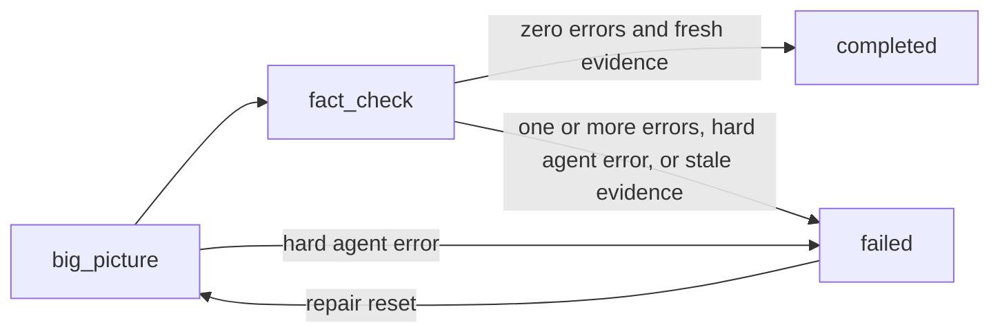

# Phase 3: Audit

## State Machine



The big-picture auditor runs first (one opus agent, holistic view). Then
fact-checkers run as a file-processor loop (one sonnet agent per document file).

<!-- audit-legal-steps -->

The legal step set is exactly: `big_picture`, `fact_check`, `completed`,
and `failed`.

## State File: `audit-state.json`

This is the canonical audit-state schema. It has exactly 11 top-level fields.

<!-- audit-state-schema -->

```json
{
  "step": "big_picture | fact_check | completed | failed",
  "auditEpoch": 1,
  "docsDigest": "39e77a6619ba41e414906e08eb0f1d62d3069469c2b7cd5f702058869f256fb9",
  "bigPictureComplete": false,
  "bigPictureErrors": 0,
  "bigPictureWarnings": 0,
  "factCheckComplete": false,
  "factCheckErrors": 0,
  "factCheckWarnings": 0,
  "totalErrors": 0,
  "acceptedWarnings": []
}
```

`auditEpoch` is a positive integer. Creation starts at 1, and only a repair
reset increments it. `docsDigest` is never null: it is the lowercase SHA-256
digest of the complete regular-file set under `docsRoot` when the epoch opens.

### Canonical Docs Digest

The digest hashes each document's path relative to `docsRoot`, a NUL byte, the
file's exact bytes, and another NUL byte. Entries are sorted by relative path
under the C locale before hashing. The path framing means a rename changes the
digest; `find -type f` means tracked, untracked, ignored, and generated regular
documents all participate. Symlinks and directories are not regular documents
and are not followed.

Run this Bash definition from the repository root:

```bash
set -o pipefail

docs_digest() {
  local docs_root="${1:?docsRoot is required}"

  if [[ ! -d "$docs_root" ]]; then
    return 1
  fi

  (
    cd -- "$docs_root" || exit 1
    find . -type f -print0 |
      LC_ALL=C sort -z |
      while IFS= read -r -d '' doc; do
        relative_path=${doc#./}
        printf '%s\0' "$relative_path"
        cat -- "$doc" || exit 1
        printf '\0'
      done
  ) | sha256sum | cut -d ' ' -f1
}

docs_root=$(jq -er '.docsRoot | select(type == "string" and length > 0)' \
  .contributor-docs/task-state.json)
docs_digest "$docs_root"
```

Do not substitute a Git index or tree listing for this byte walk. Index-only
commands cannot see an untracked generated document or its bytes.

The following known-answer control also proves sensitivity to one tracked and
one untracked document-byte change. Run it in the same Bash shell after defining
`docs_digest` above:

```bash
control_repo=$(mktemp -d)
trap 'rm -rf -- "$control_repo"' EXIT
mkdir -p "$control_repo/docs/guide"
printf 'alpha\n' >"$control_repo/docs/guide/a.md"
printf 'beta\n' >"$control_repo/docs/z.mdx"
git -C "$control_repo" init -q
git -C "$control_repo" add docs/guide/a.md

known=39e77a6619ba41e414906e08eb0f1d62d3069469c2b7cd5f702058869f256fb9
baseline=$(docs_digest "$control_repo/docs")
test "$baseline" = "$known"

printf 'Alpha\n' >"$control_repo/docs/guide/a.md"
tracked_changed=$(docs_digest "$control_repo/docs")
test "$tracked_changed" != "$baseline"
printf 'alpha\n' >"$control_repo/docs/guide/a.md"
test "$(docs_digest "$control_repo/docs")" = "$baseline"

printf 'Beta\n' >"$control_repo/docs/z.mdx"
untracked_changed=$(docs_digest "$control_repo/docs")
test "$untracked_changed" != "$baseline"
```

## State Transitions

All state writes go through the audit state-agent. The state-agent validates the
complete object and refuses unknown fields before each write.

| From                          | To            | Trigger                                                                                     | Required effects                                                                                                                                                               |
| ----------------------------- | ------------- | ------------------------------------------------------------------------------------------- | ------------------------------------------------------------------------------------------------------------------------------------------------------------------------------ |
| no audit state                | `big_picture` | First audit entry                                                                           | Set epoch 1, compute `docsDigest`, and initialize every flag, counter, and warning collection                                                                                  |
| `big_picture`                 | `fact_check`  | A current-stamp big-picture report                                                          | Set the big-picture flag and counters; carry its error count into `totalErrors`                                                                                                |
| `fact_check`                  | `completed`   | Both arms are current, every file hash matches, digest is unchanged, and `totalErrors == 0` | Set the fact-check flag and counters and record accepted warnings                                                                                                              |
| `fact_check`                  | `failed`      | A complete current audit has `totalErrors > 0`                                              | Set the fact-check flag and counters, preserve measured results, and set `step: "failed"`                                                                                      |
| `big_picture` or `fact_check` | `failed`      | An audit agent has a hard error or evidence becomes stale                                   | Preserve every result measured so far and set only `step: "failed"`; record the reason in the orchestrator's audit run report and the transition log, not in a new state field |
| `failed`                      | `big_picture` | Repair reset                                                                                | Atomically install the next epoch's fully reset state, then idempotently remove prior-epoch artifacts                                                                          |

The `failed` to `big_picture` edge is available only through the reset mode.
Ordinary update mode cannot change `auditEpoch` or `docsDigest`.
Every transition to `audit-state.step: "failed"` is paired, through the same
state-agent, with `task-state.currentPhase: "failed"`. The hard-error reason
still remains outside the audit-state schema.

## Step Dispatch

On entry, spawn the audit state-agent to assess. **NEVER read step files
directly** — spawn a teammate and tell it which step file to read. The
file-processor loop for fact-check is managed by the orchestrator using scripts.

| Condition                     | Action                                                                                                                                     |
| ----------------------------- | ------------------------------------------------------------------------------------------------------------------------------------------ |
| No `audit-state.json`         | Create via state-agent, then spawn the big-picture auditor                                                                                 |
| `step: "big_picture"`         | Spawn big-picture auditor — tell it to read `docs/standards/contributor-docs/audit/big-picture.md`                                         |
| `step: "fact_check"`          | Run the fact-check file-processor loop below                                                                                               |
| `step: "completed"`           | Advance `task-state.currentPhase` to `"completed"` via state-agent                                                                         |
| `step: "failed"`              | Run the repair loop; never advance directly to `"completed"`                                                                               |
| Hard error in an active agent | Via state-agent, make the legal transition from the active step and `task-state.currentPhase` to `failed`, then record the external reason |

## Big-Picture Step

Pass the current `auditEpoch` and `docsDigest` to a single opus team agent.
After it reports:

1. Verify that the report carries both exact values.
2. Treat a missing or mismatched stamp as stale and regenerate the report; never
   count it.
3. Via state-agent, set `bigPictureComplete: true`,
   `bigPictureErrors: <error count>`,
   `bigPictureWarnings: <warning count>`,
   `totalErrors: <big-picture error count>`, and `step: "fact_check"`.

Errors found here do **not** short-circuit the phase. Fact-check still runs so
the repair loop sees the whole picture at once.

## File-Processor Loop (Fact Check)

### 1. Initialize or Resume

Read `.contributor-docs/doc-plan.yaml` and extract every document file path
across modules, shared, top-level, and ADRs, excluding indexes.

Processor state is reusable only when all of these are true:

- `.contributor-docs/fact-check/state.json` exists;
- its audit-specific sibling `.contributor-docs/fact-check/epoch.json` exists
  and matches the current `auditEpoch` and `docsDigest`;
- every finding for a file already marked done carries the current epoch and
  digest plus the SHA-256 of that file's current exact bytes.

No pending files is not evidence that a processor state belongs to this epoch.
A missing stamp, a mismatch, or a prior-format artifact makes the whole
fact-check cache stale. Remove the processor state, epoch sidecar, and findings,
then initialize from the full document list. With `all_doc_files`,
`source_paths_json`, and `concurrent_agents` populated by the orchestrator, the
root-relative command is:

```bash
printf '%s\n' "${all_doc_files[@]}" |
  bash docs/standards/contributor-docs/scripts/init-state.sh \
  .contributor-docs/fact-check/state.json \
  "$source_paths_json" \
  "$concurrent_agents" \
  '.contributor-docs/fact-check/findings'
```

Immediately after initialization, atomically write this sibling file with the
current values:

```json
{
  "auditEpoch": 1,
  "docsDigest": "39e77a6619ba41e414906e08eb0f1d62d3069469c2b7cd5f702058869f256fb9"
}
```

The sibling exists because `init-state.sh` and its processor-state format are
shared with the write phase. They are not audit-specific and must not be
modified to carry audit metadata.

### 2. Process Loop

```text
while next-file.sh returns files:
  1. Get the next batch from .contributor-docs/fact-check/state.json.
  2. Immediately before dispatch, SHA-256 the exact bytes of each assigned file.
  3. Spawn one fact-checker per file with file path, sources, auditEpoch,
     docsDigest, and the per-file SHA-256.
  4. Wait for every agent in the batch.
  5. Verify each finding's three stamps and recompute its file SHA-256.
  6. Mark a file done only after all three values match; otherwise regenerate it.
```

With `document_path` and `concurrent_agents` set for the batch, the
root-relative processor commands remain:

```bash
bash docs/standards/contributor-docs/scripts/next-file.sh \
  .contributor-docs/fact-check/state.json --batch "$concurrent_agents"

sha256sum -- "$document_path" | cut -d ' ' -f1

bash docs/standards/contributor-docs/scripts/mark-done.sh \
  .contributor-docs/fact-check/state.json "$document_path"
```

An agent hard error transitions the active audit step to `failed`. Its reason
belongs in the orchestrator's audit run report and transition log; it does not
add a field to `audit-state.json`.

### 3. Fact Check Complete

When all files are processed:

1. Require one finding for every processor input and verify every finding's
   epoch, digest, and exact per-file hash.
2. Aggregate only those current findings and split their severities into errors
   and warnings.
3. Via state-agent, set `factCheckComplete: true`, the fact-check counters,
   and `totalErrors: <big-picture errors + fact-check errors>`.
4. Recompute the canonical docs digest from the live tree.
5. Set `step: "completed"` only when both arms are current, the recomputed
   digest equals the epoch's `docsDigest`, and `totalErrors == 0`. Otherwise
   set `step: "failed"`.

## Phase Completion

Completion requires all of the following at the same validation point:

- both `bigPictureComplete` and `factCheckComplete` are true;
- the big-picture report has the current epoch and digest;
- the fact-check epoch sidecar and every required finding have the current epoch
  and digest;
- every finding's file hash equals a fresh hash of the assigned document;
- a fresh whole-tree digest equals `audit-state.json.docsDigest`;
- both arms were generated in this epoch; same-epoch crash recovery may reuse
  only that already-current evidence;
- `totalErrors` equals the sum of the two error counters and is zero.

A report with no stamp or any mismatch is stale. Regenerate it; never accept it
or count it toward completion.

After compiling the combined audit result, classify every finding as an
**error** (the docs state something untrue, or a required file/section is
missing) or a **warning** (style, coverage suggestions, non-blocking nits).

Branch on the error count. **A nonzero error count may never reach
`completed`:**

| Result                     | `task-state.json` transition                                |
| -------------------------- | ----------------------------------------------------------- |
| 0 errors, 0 warnings       | `currentPhase: "completed"`                                 |
| 0 errors, warnings present | `currentPhase: "completed"` — see the acceptance rule below |
| 1 or more errors           | `currentPhase: "failed"` — never `completed`                |

Report final error and warning counts separately.

### Warning Acceptance

Warnings do not block completion, but they are not silently discarded. Record
them in `acceptedWarnings` with the audit artifact they came from so completed
state explicitly identifies what was accepted. Reset clears the collection.

### Repair Loop (`failed`)

`failed` is a working state, not a dead end. On re-invocation with
`currentPhase: "failed"`:

1. Present the outstanding errors from the current audit reports.
2. Fix them by re-running affected write-tier files or making targeted document
   edits.
3. Invoke state-agent reset. From `step: "failed"`, it increments
   `auditEpoch`, recomputes `docsDigest`, builds the complete reset object
   (`step: "big_picture"`, false completion flags, zero counters, and an empty
   `acceptedWarnings`), and installs that object with one atomic temp-file
   rename. That rename is the reset's commit marker.
4. Only after the commit marker lands, remove
   `.contributor-docs/big-picture-report.md`,
   `.contributor-docs/fact-check/state.json`,
   `.contributor-docs/fact-check/epoch.json`, and every findings artifact under
   `.contributor-docs/fact-check/findings/`. Remove them in place; do not
   archive or rename the canonical paths.
5. Set `task-state.json.currentPhase` to `"audit"` and re-audit from the top.
   Partial re-audits are not permitted.

A crash before the state rename leaves the old failed epoch intact. A crash
after it leaves a committed new epoch plus stale artifacts whose epoch or digest
cannot match; they are rejected and removed idempotently when reset resumes.
Resume never increments the already committed epoch a second time. A crash after
artifact removal but before the task-state update is also safe: reset recognizes
the committed reset while `currentPhase` is still `"failed"`, repeats cleanup,
and finishes the task-state transition.

The loop repeats until a fresh audit run reports zero errors. Only that clean,
content-stable run may set `completed`.
