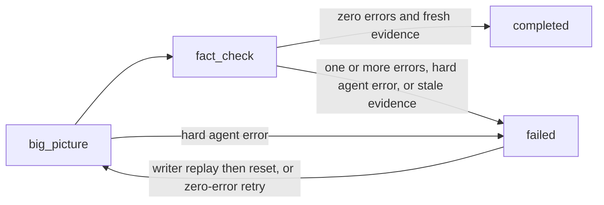

# Phase 3: Audit

## State Machine



The big-picture auditor runs first (one opus agent, holistic view). Then
fact-checkers run as a file-processor loop (one sonnet agent per document file).

<!-- audit-legal-steps -->

The legal step set is exactly: `big_picture`, `fact_check`, `completed`,
and `failed`.

## State File: `audit-state.json`

This is the canonical audit-state schema. It has exactly 11 top-level fields.

<!-- audit-state-schema -->

```json
{
  "step": "big_picture | fact_check | completed | failed",
  "auditEpoch": 1,
  "docsDigest": "39e77a6619ba41e414906e08eb0f1d62d3069469c2b7cd5f702058869f256fb9",
  "bigPictureComplete": false,
  "bigPictureErrors": 0,
  "bigPictureWarnings": 0,
  "factCheckComplete": false,
  "factCheckErrors": 0,
  "factCheckWarnings": 0,
  "totalErrors": 0,
  "acceptedWarnings": []
}
```

`auditEpoch` is a positive integer. Creation starts at 1, and only a repair
reset increments it. `docsDigest` is never null: it is the lowercase SHA-256
digest of the complete regular-file set under `docsRoot` when the epoch opens.

Each `acceptedWarnings` element has this exact ten-field shape:

<!-- canonical-block: accepted-warning-record -->

```json
{
  "artifactPath": ".contributor-docs/fact-check/findings/docs__guide.md",
  "artifactHash": "39e77a6619ba41e414906e08eb0f1d62d3069469c2b7cd5f702058869f256fb9",
  "auditEpoch": 1,
  "docsDigest": "39e77a6619ba41e414906e08eb0f1d62d3069469c2b7cd5f702058869f256fb9",
  "documentPath": "docs/contributor/guide.mdx",
  "documentHash": "39e77a6619ba41e414906e08eb0f1d62d3069469c2b7cd5f702058869f256fb9",
  "findingOrdinal": 1,
  "findingHash": "39e77a6619ba41e414906e08eb0f1d62d3069469c2b7cd5f702058869f256fb9",
  "severity": "warning",
  "description": "Clarify the retry example"
}
```

For a big-picture warning, `artifactPath` is the canonical big-picture report and
both document fields are null. For a fact-check warning, they name the assigned
document and its freshly verified hash. `findingOrdinal` is one-based within the
artifact's warning sequence. `findingHash` is SHA-256 of the exact UTF-8 bytes from
that warning's item heading through the byte before the next item heading, enclosing
section heading, or end of file. `description` is the exact heading text with its
ordinal prefix removed. Unknown fields are refused.

### Approved Plan Identity

Plan identity is derived context, not an audit-state field. Every audit create,
assessment, update, reset, dispatch, processor mutation, and task-phase handoff reads
and completely validates `plan-state.json` and the canonical 14-field
`write-state.json`. The write state is mandatory read-only authority even on the first
audit entry and on ordinary successful runs; it is not merely repair evidence.

The authority chain is exact:

1. Require the immutable plan state to have its complete canonical schema,
   `step: "completed"`, `approved: true`, no feedback, and the canonical
   `.contributor-docs/doc-plan.yaml` path and lowercase `planHash`. Set
   `cursor = plan-state.json.planHash`.
2. Walk `write-state.json.gapsResolved` in append order. Every record is completely
   valid and `cleared`; its complete `planMutation` record has
   `fromPlanHash == cursor`. Advance `cursor` to its `toPlanHash`.
3. With no live gap, require the candidate sidecar absent and
   `cursor == write-state.json.authorizedPlanHash == SHA256` of the exact complete
   live plan bytes.
4. With a live `planned`, `prepared`, `scaffolded`, `reset`, or `cleaned` gap, require
   its complete `planMutation.fromPlanHash == cursor`, then require
   `planMutation.toPlanHash == authorizedPlanHash == SHA256(live plan)` and advance
   the derived cursor to `toPlanHash`. The candidate sidecar is absent.
5. The sole exceptional tuple is a completely valid `enqueued` gap with
   `authorizedPlanHash == fromPlanHash == cursor`. The live hash may still be
   `fromPlanHash` with the candidate present and freshly hashing to `toPlanHash`, or it
   may be `toPlanHash` with the candidate absent after the candidate-to-live rename
   landed. Assessment reports `gapPlanApplyRequired: true`; only write state-agent
   `apply-gap-plan` may consume either tuple. No audit operation may authorize or
   finish a plan mutation.

A missing plan, invalid lineage, invalid candidate/live tuple, or live hash different
from `authorizedPlanHash` outside that fenced apply recovery is
`PLAN_DRIFT_BLOCKED: expected=<hash> actual=<hash-or-absent>`. It preempts all audit
and recovery work. Audit state, task state, transition logs, processor state,
findings, the big-picture report, and reset-owned artifacts remain byte-identical.
Assessment reports the exact derived fields `approvedPlanHash`,
`authorizedPlanHash`, `livePlanHash`, `planHashCurrent`, `planHashMismatch`, and
`gapPlanApplyRequired`; `planHashCurrent` is true only when the complete chain and
ordinary live identity are current. Assessment is a read-only observation and takes no
lock; it confers no capability, so any mutation based on it reacquires the canonical
lock and revalidates from disk.

The canonical lock in [workflow.md](../workflow.md#authority-transaction) is advisory
and orders only the contract-compliant mutators listed there. A raw editor write to a
document, a plan, or a state file cannot be prevented by it. Such a write is caught the
same way it always was: by transaction byte fingerprints from the first authority read
through the last authority read, and by the fresh source, plan, digest, and document
hashes above once it has landed. The residual interval between that last read and `mv`
is closed by the exclusive advisory lock every compliant writer takes, not by the
rename itself. An out-of-contract writer that ignores the lock in that interval is
detected by downstream assessment after commit rather than guaranteed a pre-rename
refusal. Direct state or plan mutation stays invalid — the lock does not make a hostile
writer impossible, only a compliant one orderly.

### Canonical Docs Digest

The digest hashes each document's path relative to `docsRoot`, a NUL byte, the
file's exact bytes, and another NUL byte. Entries are sorted by relative path
under the C locale before hashing. The path framing means a rename changes the
digest; `find -type f` means tracked, untracked, ignored, and generated regular
documents all participate. Symlinks and directories are not regular documents
and are not followed.

Run this Bash definition from the repository root:

```bash
set -o pipefail

docs_digest() {
  local docs_root="${1:?docsRoot is required}"

  if [[ ! -d "$docs_root" ]]; then
    return 1
  fi

  (
    cd -- "$docs_root" || exit 1
    find . -type f -print0 |
      LC_ALL=C sort -z |
      while IFS= read -r -d '' doc; do
        relative_path=${doc#./}
        printf '%s\0' "$relative_path"
        cat -- "$doc" || exit 1
        printf '\0'
      done
  ) | sha256sum | cut -d ' ' -f1
}

docs_root=$(jq -er '.docsRoot | select(type == "string" and length > 0)' \
  .contributor-docs/task-state.json)
docs_digest "$docs_root"
```

Do not substitute a Git index or tree listing for this byte walk. Index-only
commands cannot see an untracked generated document or its bytes.

The following known-answer control also proves sensitivity to one tracked and
one untracked document-byte change. Run it in the same Bash shell after defining
`docs_digest` above:

```bash
control_repo=$(mktemp -d)
trap 'rm -rf -- "$control_repo"' EXIT
mkdir -p "$control_repo/docs/guide"
printf 'alpha\n' >"$control_repo/docs/guide/a.md"
printf 'beta\n' >"$control_repo/docs/z.mdx"
git -C "$control_repo" init -q
git -C "$control_repo" add docs/guide/a.md

known=39e77a6619ba41e414906e08eb0f1d62d3069469c2b7cd5f702058869f256fb9
baseline=$(docs_digest "$control_repo/docs")
test "$baseline" = "$known"

printf 'Alpha\n' >"$control_repo/docs/guide/a.md"
tracked_changed=$(docs_digest "$control_repo/docs")
test "$tracked_changed" != "$baseline"
printf 'alpha\n' >"$control_repo/docs/guide/a.md"
test "$(docs_digest "$control_repo/docs")" = "$baseline"

printf 'Beta\n' >"$control_repo/docs/z.mdx"
untracked_changed=$(docs_digest "$control_repo/docs")
test "$untracked_changed" != "$baseline"
```

## State Transitions

All state writes go through the audit state-agent. The state-agent validates the
complete object and refuses unknown fields before each write.

| From                          | To            | Operation            | Trigger                                                                                          | Required effects                                                                                                                                                               |
| ----------------------------- | ------------- | -------------------- | ------------------------------------------------------------------------------------------------ | ------------------------------------------------------------------------------------------------------------------------------------------------------------------------------ |
| no audit state                | `big_picture` | `create`             | First audit entry                                                                                | Set epoch 1, compute `docsDigest`, and initialize every flag, counter, and warning collection                                                                                  |
| `big_picture`                 | `fact_check`  | `record-big-picture` | A current-stamp big-picture report                                                               | Derive and set the big-picture flag and counters; carry its error count into `totalErrors`                                                                                     |
| `fact_check`                  | `completed`   | `complete-audit`     | Both arms are current, every file hash matches, digest is unchanged, and derived errors are zero | Derive the fact-check flag/counters and the complete sorted accepted-warning record set from current artifacts                                                                 |
| `fact_check`                  | `failed`      | `fail-audit`         | A complete current audit has a derived nonzero error sum                                         | Derive the fact-check flag and counters, preserve measured results, and set `step: "failed"`                                                                                   |
| `big_picture` or `fact_check` | `failed`      | `fail-audit`         | An audit agent has a hard error or evidence becomes stale                                        | Preserve every result measured so far and set only `step: "failed"`; record the reason in the orchestrator's audit run report and the transition log, not in a new state field |
| `failed`                      | `big_picture` | `reset`              | No current stamped content error, or an exact current `auditRepair: completed` marker            | Atomically install the next epoch's fully reset state, then idempotently remove prior-epoch artifacts                                                                          |

The `failed` to `big_picture` edge is available only through the named reset mode.
No update operation can change `auditEpoch` or `docsDigest`.
Every edge in the table requires a fresh, complete plan-authority validation at the
same validation point as its source, evidence, digest, and candidate-state checks.
This includes hard-error failure pairing and retry, reset and reset-cleanup resume,
and both terminal transitions. Reports and findings must carry the exact current
`PLAN_SHA256`; acceptance freshly rehashes the live plan before any state or processor
mutation.
Every transition to `audit-state.step: "failed"` is paired, through the same
state-agent, with `task-state.currentPhase: "failed"`. The hard-error reason
still remains outside the audit-state schema.
A zero-current-error failure whose queued written bytes no longer match retained
provenance has no transition: it reports the named non-mutating authority outcome
`WRITE_DRIFT_BLOCKED: <paths>` instead of invalidating evidence over changed bytes.

## Step Dispatch

On entry, spawn the audit state-agent to assess. **NEVER read step files
directly** — spawn a teammate and tell it which step file to read. The
file-processor loop for fact-check is managed by the orchestrator using scripts.

| Condition                                              | Action                                                                                                                                  |
| ------------------------------------------------------ | --------------------------------------------------------------------------------------------------------------------------------------- |
| `sourceSnapshotCurrent: false`                         | Report `SOURCE_DRIFT_BLOCKED` with exact drift evidence and mutate nothing                                                              |
| `planHashCurrent: false` or `planHashMismatch != none` | Report `PLAN_DRIFT_BLOCKED` with the exact expected/actual or lineage evidence and mutate nothing                                       |
| `gapPlanApplyRequired: true`                           | Dispatch no auditor or recovery; return control to write dispatch, where only `apply-gap-plan` may advance the stored authority         |
| `resetResumeRequired: true`                            | Resume reset-owned stale-artifact cleanup without incrementing `auditEpoch`; finish task phase when still `failed`                      |
| `failurePairingResumeRequired: true`                   | Invoke `resume-failed-task-phase`; do not interpret task phase `audit` as completed repair                                              |
| `step: "failed"` and `repairOutOfScope != none`        | Report `REPAIR_OUT_OF_SCOPE` with the exact current errors and mutate nothing                                                           |
| `step: "failed"` and `writeDriftBlocked != none`       | Report `WRITE_DRIFT_BLOCKED` with the exact drifted queued paths and mutate nothing                                                     |
| No `audit-state.json`                                  | Invoke state-agent `create`, then spawn the big-picture auditor                                                                         |
| `step: "big_picture"`                                  | Spawn the big-picture auditor, then invoke `record-big-picture` on its current stamped report                                           |
| `step: "fact_check"`                                   | Run the fact-check file-processor loop; invoke `complete-audit` for zero derived errors or `fail-audit` for a nonzero derived error sum |
| `step: "completed"`                                    | Invoke `advance-task-phase-to-completed`; do not issue a generic task-state update                                                      |
| `step: "failed"`                                       | Run the repair loop; never advance directly to `"completed"`                                                                            |
| Hard error in an active agent                          | Invoke `fail-audit` with the external reason; it pairs the audit-state and task-phase failure writes                                    |

Evaluate source drift first and plan drift second before all audit, reset, failure,
crash-reconciliation, or terminal work. A valid pending gap apply is also not audit
authority. Only after those guards may reset resume and the separated
failure-pairing row run. They are the only safe actions while a committed new epoch
still has old artifacts, or while an audit failure rename has landed without its
paired task-phase rename. The two failed-state authority outcomes are evaluated before
the generic failed repair/reset row. Partial big-picture or fact-check findings never
select either outcome and therefore never short-circuit the other audit arm.

## Big-Picture Step

Require current plan identity immediately before dispatch. Pass the current
`auditEpoch`, `docsDigest`, and `authorizedPlanHash` as `PLAN_SHA256` to a single opus
team agent.
After it reports:

1. Verify that the report and artifact carry all three exact values.
2. Treat a missing or mismatched stamp as stale and regenerate the report; never
   count it.
3. Freshly reassess the complete authority chain and rehash the exact live plan. A
   mismatch is `PLAN_DRIFT_BLOCKED` and leaves the report and state byte-identical.
4. Invoke state-agent `record-big-picture`. It independently derives the report's
   error and warning counts, requires its summary counters to match, then sets
   `bigPictureComplete: true`, those counters, `totalErrors` to the derived error
   count, and `step: "fact_check"`.

Errors found here do **not** short-circuit the phase. Fact-check still runs so
the repair loop sees the whole picture at once.

## File-Processor Loop (Fact Check)

### 1. Initialize or Resume

Only after audit-state assessment reports a current complete authority chain, hash the
exact live `.contributor-docs/doc-plan.yaml` and require equality with
`authorizedPlanHash`. Then parse those same authorized bytes and extract every
document file path across modules, shared, top-level, and ADRs, excluding indexes.
Plan drift before initialization leaves processor state, the epoch sidecar, and
findings byte-identical.

Processor state is reusable only when all of these are true:

- `.contributor-docs/fact-check/state.json` exists;
- its audit-specific sibling `.contributor-docs/fact-check/epoch.json` exists
  and matches the current `auditEpoch` and `docsDigest`;
- every finding for a file already marked done carries the current epoch, digest,
  current `PLAN_SHA256`, and SHA-256 of that file's current exact bytes.

No pending files is not evidence that a processor state belongs to this epoch.
A missing stamp, a mismatch, or a prior-format artifact makes the whole
fact-check cache stale. Remove the processor state, epoch sidecar, and findings,
then initialize from the full document list. With `all_doc_files`,
`source_paths_json`, and `concurrent_agents` populated by the orchestrator, the
root-relative command is:

```bash
printf '%s\n' "${all_doc_files[@]}" |
  bash docs/standards/contributor-docs/scripts/init-state.sh \
  .contributor-docs/fact-check/state.json \
  "$source_paths_json" \
  "$concurrent_agents" \
  '.contributor-docs/fact-check/findings' \
  --plan-hash "$authorized_plan_hash"
```

The audit state-agent supplies `authorized_plan_hash` only after its fresh complete
authority assessment. `init-state.sh` runs the whole initialization as one authority
transaction from [workflow.md](../workflow.md#authority-transaction): it acquires the
canonical lock before its first authority or state read, repeats the
closed-chain/live-hash/candidate checks immediately before its atomic processor-state
rename, and freshly rechecks the processor-state preimage — including proven absence —
while holding that lock before performing the ordinary atomic rename. A mismatch
observed by that final check refuses before replacement; the compliant-writer scope is
defined by [Authority Transaction](../workflow.md#authority-transaction). A refusal
creates no processor state and leaves no temp file.

A fact-check processor carries `"recordWriteAuthorizations": null`. That field is the
durable start-authority map for write-tier processors only; fact-checkers audit bytes
and never call `record-write`, so there is no start authority to capture and an
explicit `null` is required rather than an absent key. Contention while initializing
is `AUTHORITY_BUSY`, leaving processor state, the sidecar, and findings byte-identical.

Immediately after `init-state.sh` returns, take a second, separate Authority
Transaction to write this sibling file. Acquire the canonical lock again; contention
is `AUTHORITY_BUSY` and leaves the processor state exactly as initialization left it.
Under that second acquisition, freshly reread `audit-state.json` for the current
`auditEpoch`, recompute `docsDigest`, stage the sibling in
`.contributor-docs/fact-check/`, and atomically `mv` it into place with the current
values:

```json
{
  "auditEpoch": 1,
  "docsDigest": "39e77a6619ba41e414906e08eb0f1d62d3069469c2b7cd5f702058869f256fb9"
}
```

There is deliberately a crash window between initialization and this second
acquisition. If the process dies there, the sidecar is absent. The existing
**Initialize or Resume** staleness rule in this section classifies a missing or
mismatched sidecar as a stale cache: remove processor state, sidecar, and findings, then
reinitialize.

The sibling exists because `init-state.sh` and its processor-state format are
shared with the write phase. They are not audit-specific and must not be
modified to carry audit metadata.

### 2. Process Loop

```text
while next-file.sh returns files:
  1. Reassess source and plan identity, then freshly require the live plan hash to
     equal authorizedPlanHash before next-file may mutate processor state.
  2. Get the next batch from .contributor-docs/fact-check/state.json.
  3. Immediately before dispatch, SHA-256 the exact plan and each assigned file.
  4. Spawn one fact-checker per file with file path, docsRoot, sources, exact plan
     type/tier/crossLinks metadata, the complete normalized planned-path set,
     auditEpoch, docsDigest, PLAN_SHA256, and the per-file SHA-256.
  5. Wait for every agent in the batch.
  6. Verify each finding's four stamps and recompute its file and plan SHA-256.
  7. Mark a file done only after all four values and the full authority chain match;
     otherwise return PLAN_DRIFT_BLOCKED or regenerate stale non-plan evidence.
```

With `document_path` and `concurrent_agents` set for the batch, the
root-relative processor commands remain:

```bash
bash docs/standards/contributor-docs/scripts/next-file.sh \
  .contributor-docs/fact-check/state.json --batch "$concurrent_agents"

sha256sum -- "$document_path" | cut -d ' ' -f1

bash docs/standards/contributor-docs/scripts/mark-done.sh \
  .contributor-docs/fact-check/state.json "$document_path" \
  --plan-hash "$authorized_plan_hash"
```

`mark-done.sh` runs as one authority transaction from
[workflow.md](../workflow.md#authority-transaction). It acquires the canonical lock
before its first processor or authority read, requires the processor's stored authority
to match, freshly repeats the complete chain/live-plan check, and makes its atomic
rename only after a final processor-state preimage recheck under that lock. Compliant
concurrent marks therefore cannot interleave or lose one another. Plan drift or a
changed preimage observed by that final check leaves processor state byte-identical;
contention is `AUTHORITY_BUSY` with nothing marked. The residual read-to-rename interval
for an out-of-contract writer has the exact scope stated in
[Authority Transaction](../workflow.md#authority-transaction). `next-file.sh` stays
read-only and takes no lock: it returns an observation, and every mutation derived from
it revalidates under its own acquisition.

An agent hard error transitions the active audit step to `failed`. Its reason
belongs in the orchestrator's audit run report and transition log; it does not
add a field to `audit-state.json`.

### 3. Fact Check Complete

When all files are processed:

1. Require one finding for every processor input and verify every finding's
   epoch, digest, exact `PLAN_SHA256`, and exact per-file hash.
2. Aggregate only those current findings and split their severities into errors
   and warnings.
3. Invoke state-agent `complete-audit` when the independently derived combined error
   sum is zero, or `fail-audit` when it is nonzero. Both operations derive
   `factCheckComplete`, the fact-check counters, and `totalErrors` from the current
   artifacts. `complete-audit` also independently derives `acceptedWarnings` rather
   than trusting a caller collection.
4. Recompute the canonical docs digest from the live tree.
5. `complete-audit` sets `step: "completed"` only when both arms are current, the
   recomputed digest equals the epoch's `docsDigest`, and the derived error sum is
   zero. At that same validation point it freshly validates the full plan lineage and
   requires the exact live hash and every artifact stamp to equal
   `authorizedPlanHash`. A nonzero current sum selects `fail-audit`; stale non-plan
   evidence is regenerated or becomes a reason-bearing `fail-audit`, while plan drift
   is always the prior non-mutating blocker.

## Phase Completion

Completion requires all of the following at the same validation point:

- both `bigPictureComplete` and `factCheckComplete` are true;
- the big-picture report has the current epoch and digest;
- the fact-check epoch sidecar and every required finding have the current epoch
  and digest;
- every finding's file hash equals a fresh hash of the assigned document;
- a fresh whole-tree digest equals `audit-state.json.docsDigest`;
- the canonical source snapshot remains current;
- the complete approved-plan/gap lineage is valid, the candidate sidecar state is
  valid, and a fresh exact plan hash equals `write-state.json.authorizedPlanHash`;
- every big-picture and fact-check report carries that same value as `PLAN_SHA256`;
- both arms were generated in this epoch; same-epoch crash recovery may reuse
  only that already-current evidence;
- `totalErrors` equals the sum of the two error counters and is zero.

A report with no stamp or any mismatch is stale. Regenerate it; never accept it
or count it toward completion.

After compiling the combined audit result, classify every finding as an
**error** (the docs state something untrue, or a required file/section is
missing) or a **warning** (style, coverage suggestions, non-blocking nits).

Branch on the error count. **A nonzero error count may never reach
`completed`:**

| Result                     | Audit operation  | Task-phase operation                                                                |
| -------------------------- | ---------------- | ----------------------------------------------------------------------------------- |
| 0 errors, 0 warnings       | `complete-audit` | `advance-task-phase-to-completed`                                                   |
| 0 errors, warnings present | `complete-audit` | `advance-task-phase-to-completed` after the exact warning acceptance rule below     |
| 1 or more errors           | `fail-audit`     | The same operation pairs task phase `audit → failed`; never enter audit `completed` |

Report final error and warning counts separately.

### Warning Acceptance

Warnings do not block completion, but they are not silently discarded. At the
`fact_check → completed` edge, the state-agent enumerates every warning block from the
current stamped big-picture report and every required current fact-check finding. It
freshly hashes each whole artifact, verifies the current epoch/digest and document hash
where applicable, derives the ten-field record above, and sorts the complete set by
`artifactPath` under the C locale and then by `findingOrdinal`.

The derived record count must equal `bigPictureWarnings + factCheckWarnings`; duplicate
artifact/ordinal pairs, malformed warning blocks, missing warnings, or a counter
mismatch refuse completion. If the caller supplies `acceptedWarnings`, it must be
exactly equal to the independently derived sorted array. An omission, fabricated
entry, stale stamp, artifact-hash mismatch, document-hash mismatch, or finding-hash
mismatch reports `WARNING_ACCEPTANCE_MISMATCH` and leaves state byte-identical. When
the caller omits the field, the state-agent installs the derived array itself. Before
completion the collection remains empty. Reset clears it.

Warning derivation and acceptance run only after the same fresh plan-authority check.
No warning block from a missing, mismatched, or unauthorized `PLAN_SHA256` stamp is
evidence, even when its epoch, docs digest, and document hash remain current.

### Repair Loop (`failed`)

`failed` is a working state, not a dead end. Top-level failed dispatch starts the
writer-authorized repair route, and ordinary audit dispatch returns here after that
route sets task phase back to `audit`. Both routes spawn state-agent assessment; there
is no manual state-file call or generic retry branch:

1. Present the outstanding current-stamp errors and map every content error to the
   queued documentation path it names. A `missing-dependency` finding supplies its
   proposed path, type, tier, and reason but reopens the reporting document first; its
   declared new path uses the ordinary discovered-gap transition and is therefore
   inside writer authority. If any error has neither an existing queued rewrite path
   nor that declared gap route — including a skipped reporting document or a required
   move, split, merge, removal, or unsupported topology change — report
   `REPAIR_OUT_OF_SCOPE` with the exact errors and mutate nothing. It is a terminal
   authority outcome, not `INVALID_FAILED_STATE`. Require current plan identity before
   this classification so `plannedPaths` and gap eligibility come from the same
   authorized chain that produced the evidence.
2. When assessment derives `currentContentErrors > 0`, invoke write state-agent
   `reopen-audit-repair` with the
   exact affected queued paths. It freshly checks retained `writtenHash` authority,
   persists mismatches as collisions, removes stale write-tier processors, installs an
   epoch/digest/path-bound `auditRepair: replaying` marker, and routes task phase
   through `write`. The write state-agent revalidates the same complete authority chain
   before the reopen and every replay edge. **Do not make targeted document edits
   outside this operation.**
3. Complete the ordinary write-tier replay. Each successful writer result goes
   through `record-write` before processor completion; exact approvals are consumed
   once. Structured unplanned gap errors enter the normal discovered-gap transition;
   missing links to already planned paths do not. After tier 6 completes, write
   state-agent freshly verifies the marked paths, changes `auditRepair` to `completed`,
   and moves task phase back to `audit` while audit step remains `failed`.
4. Invoke audit state-agent reset. The repair rewrites document bytes, so the old
   per-file error stamps are expected to be stale now. The post-repair authority is the
   exact current `auditRepair: completed` marker plus its live `writtenHash` checks and
   the preserved nonzero total recording that this epoch found content errors. A
   hard-agent/freshness failure with no current stamped content error may reset directly
   when completed write provenance still matches disk. If those live hashes instead
   identify drifted queued paths, report `WRITE_DRIFT_BLOCKED: <paths>` and mutate
   nothing; do not collapse that authority stop into `INVALID_FAILED_STATE`. Reset
   increments `auditEpoch`, recomputes `docsDigest`, builds the
   complete reset object (`step: "big_picture"`, false completion flags, zero
   counters, and an empty `acceptedWarnings`), and installs it with one atomic
   temp-file rename. That rename is the reset's commit marker. The reset and every
   cleanup/task-phase resume revalidate current plan identity immediately before their
   next effect; `PLAN_DRIFT_BLOCKED` leaves state and artifacts byte-identical.
5. Only after the commit marker lands, and still inside the same authority
   transaction, remove `.contributor-docs/big-picture-report.md`,
   `.contributor-docs/fact-check/state.json`,
   `.contributor-docs/fact-check/epoch.json`, and every findings artifact under
   `.contributor-docs/fact-check/findings/`. Remove them in place; do not
   archive or rename the canonical paths. The lock does not reorder this: the commit
   marker still lands before deletion, and a crash between them still leaves the
   documented resume-cleanup tuple.
6. If task phase is still `failed` (the no-current-content-error path), set it to `audit`.
   A content-repair replay already returned it to `audit`. Re-audit from the top;
   partial re-audits are not permitted.

A crash before the write-state reopen loses at most processor caches. A crash after
that rename but before task phase reaches `write` is reconciled by
`resume-audit-repair-phase`; the retained hashes, pending paths, and `replaying` marker
are already the commit marker. A crash during replay follows ordinary write
reconciliation. A crash after the marker becomes `completed` but before task phase
reaches `audit` retries only that phase rename.

A crash before the audit-state reset rename leaves the old failed epoch intact. A
crash after it leaves a committed new epoch plus stale artifacts whose epoch or digest
cannot match; they are rejected and removed idempotently when reset resumes. Resume
never increments the already committed epoch a second time. On a direct no-current-error
reset, a crash after artifact removal but before the task-state update is also safe:
reset recognizes the committed reset while `currentPhase` is still `"failed"`, repeats
cleanup, and finishes the task-state transition. On a post-repair reset task phase is
already `audit`; stale prior-epoch artifacts themselves trigger cleanup reconciliation.

The loop repeats until a fresh audit run reports zero errors. Only that clean,
content-stable run may set `completed`.
