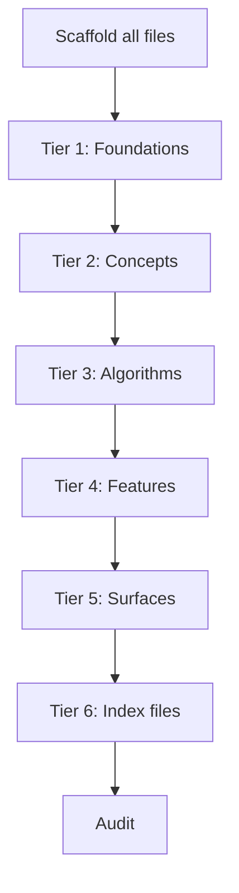

# Writing Order

When generating contributor docs, the order in which files are written matters. Writing in the wrong order causes hallucinated cross-references, duplicated content, and terminology drift.

This article defines the tier-based writing order that prevents these problems.

---

## The Core Problem

LLMs mess up docs in predictable ways:

1. **Hallucinated cross-references** -- linking to files that don't exist yet
2. **Content duplication** -- explaining a concept inline in a feature instead of linking out
3. **Terminology drift** -- calling the same thing different names across files
4. **Orphan files** -- forgetting to update index files
5. **Context pollution** -- later files contradict earlier files when written in a single context

---

## The Principle

**Write the thing being referenced before the thing that references it.**

Overviews define terms. ADRs explain decisions. Concepts explain why. Algorithms explain how. Features describe what. Surfaces describe the interface. Indexes organize everything.

---

## Phase 1: Scaffold All Files

Before writing any body content, create every file with **only frontmatter and a one-line summary**. No body content.

```mdx
---
title: 'Token Refresh'
description: 'How auth tokens are refreshed without user interaction'
date: 2026-03-03
status: draft
type: flow
tags: [auth]
related: []
---

Token refresh allows seamless re-authentication when access tokens expire.
```

This solves the hallucinated cross-reference problem. Every file path exists from the start, so any writing tier can link to any file.

---

## Phase 2: Tiered Writing

Write files in tiers. Within each tier, files can be written in parallel (by separate agents or in any order). Across tiers, the order is strict.

### Tier 1: Foundations

Written first because everything else references these.

- `00-overview.mdx`
- `02-modules.mdx`
- `03-development/` (all files)
- Each module's `overview.mdx`
- All ADRs (`01-architecture/adr-*.mdx`)
- `01-architecture/index.mdx`

### Tier 2: Concepts

Written second because features and algorithms reference them.

- `shared/concepts/` (cross-module concepts first)
- Per-module `concepts/` (all modules in parallel)

### Tier 3: Algorithms

Written third because features reference them, and they may reference concepts (now available).

- `shared/algorithms/` (cross-module algorithms first)
- Per-module `algorithms/` (all modules in parallel)

### Tier 4: Features

Written fourth. By now, concepts and algorithms exist. Features can properly link out instead of explaining inline.

- Per-module `features/` (all modules in parallel)

**Key rule:** If while writing a feature the writer discovers a missing concept or algorithm, it must **stop and report the gap** — never explain inline, and never create the file itself. Creating it is the orchestrator's transition, not the writer's; see [Discovered Gaps](#discovered-gaps) below.

### Tier 5: Surfaces

Written fifth. Surfaces describe the interface to features, so features must exist first.

- Per-module `surfaces/` (all modules in parallel)

### Tier 6: Index Files

Written last. Indexes group and relate items. Accurate groupings require all items to have body content.

- All `features/index.mdx` files
- All `concepts/index.mdx` files
- All `algorithms/index.mdx` files
- All `surfaces/index.mdx` files
- `shared/concepts/index.mdx`
- `shared/algorithms/index.mdx`

---

## Dependency Graph



---

## Context Isolation for Parallel Writing

When multiple files are written in parallel (by separate agents), each writer receives controlled context to prevent pollution:

| Input                                          | Purpose                                                            |
| ---------------------------------------------- | ------------------------------------------------------------------ |
| The scaffolded file (with frontmatter + TODOs) | Knows what to write and what it links to                           |
| Frontmatter only of all cross-referenced files | Knows titles and descriptions of linked files without full content |
| Relevant source code files                     | The actual code being documented                                   |
| Module overview (from Tier 1)                  | Establishes terminology and boundaries                             |
| Body template for the section type             | Consistent structure                                               |
| Formatting checklist                           | Quality rules                                                      |

Writers do **not** receive the full content of other files. This prevents:

- Copying content from related files instead of linking
- Context window overflow
- Terminology drift from reading conflicting sources

---

## Discovered Gaps

A writer working in tier N may find that a concept or algorithm it needs to link
to was never planned. There is exactly one legal transition for this, and the
**orchestrator owns it** — a doc-writer never creates files, because parallel
writers in the same tier would race on the same missing path and neither would
appear in the plan or the state file.

This article owns the **rationale**: why the transition is shaped the way it is.
The mechanism itself — the durable `gapTransition` record, its statuses, the
crash behaviour at each one, and the computations behind `requeued`, `replayTier`
and `resetTiers` — is defined once, in
`docs/standards/contributor-docs/write/PHASE.md`, under
[Discovered-Gap Transition](../write/PHASE.md#discovered-gap-transition). Change
the mechanism there; change the reasoning here. Duplicating the status table into
both files is how the two drift apart, and a consistency check refuses it.

### Why the orchestrator holds it

Discovering a gap and acting on it are separate jobs. The writer that found the
gap is one of several running in the same tier, has no view of the queue, and
must not touch state files. So it reports the gap — proposed path, section type,
the tier that section type belongs to, and why the feature needs it — finishes
the rest of its file, and leaves the outbound link unwritten rather than
explaining the concept inline. The orchestrator collects reports at the **tier
boundary**, never mid-tier, so the whole batch's gaps are considered together and
two writers reporting the same missing path produce one transition.

The transition preserves the complete reporter→gap mapping, not just the union of
missing paths. Planning adds each missing path to the `crossLinks` of every writer
that reported it, and replay begins from all reporters. Collapsing duplicate gaps while
retaining only one reporter would leave the other completed file unable to acquire its
new link.

### Why the re-scaffold is scoped

The scaffolder is handed **exactly the transition's gap paths** and nothing else.
This is not an optimization; a whole-plan re-scaffold cannot work at all.

Ownership is proven by a hash made durable before the possible write: ordinary
scaffolds use provenance `scaffoldHash`; a gap at prepared status uses
`gapTransition.expectedScaffold[path]` until provenance is finalized. Every
file the run has already written fails that test **by design** — writing the body
is precisely what replaced the scaffold bytes. So a re-scaffold over the whole
plan classifies every completed file as `pre-existing`, which is a blocked
collision, and the phase stops on its own successful output. The gap transition
would jam the moment it tried to resolve a gap in a run that had done any work.

Handing the scaffolder only the new paths keeps completed files out of
classification entirely: they are never hashed, never blocked, and their recorded
scaffold hashes are never touched.

### Why the replay is selective

Re-entering a tier does not mean rewriting it. The transition puts back into
`pending` only the paths that are actually stale: the new gap files, the file
that reported the gap, everything whose cross-links transitively reach a gap
path, and the indexes that list them. Everything else keeps its completed bytes
and its `written` status, and never appears in a tier's input again. Resetting a
downstream tier resets its **processor state**, so the tier re-runs against the
current queue — it does not re-run its contents.

The alternative — rewriting every file at or below the replay point — would make
each discovered gap cost a full rewrite of the documentation set, and would throw
away correct work to fix an unrelated missing link.

### When a gap transition is closed

The transition is not closed until every re-planned path is in `doc-plan.yaml`, on
the write queue with provenance, scaffolded, the affected processor state is removed,
the closed record is in `gapsResolved`, **and** `gapTransition` is back to `null`.
Only then may tier dispatch resume. The new gap file and every stale dependant are
still pending at that point; the replayed tiers write and mark them done afterward.
Anything short of the closed record is a transition still in flight, and the next run
must finish it before any tier may dispatch.

**Loop guard.** If the same path already appears in two prior `gapsResolved` records,
stop and report instead of opening a third transition. A gap that keeps coming back is a planning
failure, and retrying it forever looks like progress while nothing converges.

**One accepted hole.** A writer that discovers a gap and then dies before
reporting loses the discovery, because writers never persist state. This is
accepted deliberately: the audit phase rediscovers it as an unresolved link, and
the alternative — letting writers write state — reintroduces the parallel-writer
race this transition exists to prevent.

## Post-Writing Audit

After all tiers complete, a final audit checks:

- [ ] All `related`, `concepts`, `algorithms`, `surfaces` paths in frontmatter resolve to real files with body content
- [ ] All inline `[text](path)` links resolve to real files
- [ ] No two files explain the same concept (search for content overlap)
- [ ] Terminology is consistent across files
- [ ] Every file is reachable from `00-overview.mdx` through links/indexes
- [ ] No file exceeds ~300 lines
- [ ] All code blocks have language specified
- [ ] All diagrams use Mermaid
