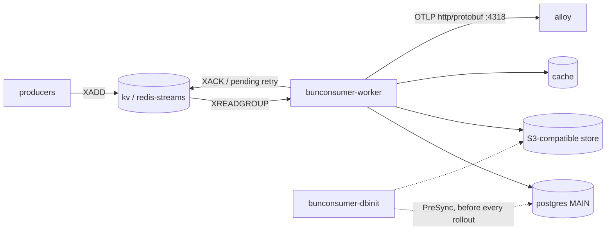

# `bunconsumer` — System Overview

## What it does

`bunconsumer` is the backend consumer/producer worker for the `diene` platform.
It **serves no HTTP**. One artifact runs in two modes: a long-running **worker**
that consumes a redis-streams consumer group and produces side effects, and a
one-shot **db-init** entry point that checks dependency reachability, creates
buckets, runs migrations, and seeds preset data idempotently. Its users are other
platform services that publish onto the stream, and the operators who own the
data it writes.

## How it works

- **worker** — `XREADGROUP` on the consumer group, handle, side-effect, `XACK`.
  Unacked entries stay pending and are re-delivered; the handler is the only
  place a message is acknowledged.
- **db-init** — one-shot Job, `PreSync` / `pre-install,pre-upgrade`, always before
  the rollout. Reachability → bucket-create (flagged) → migrate → seed-if-not-exists.
- **health** — a third subcommand reporting worker heartbeat and internal state
  **only**. Both Kubernetes probes exec it; neither ever touches a dependency
  (DQ16/R20), so a dependency blip degrades the service instead of evicting every
  pod from the workload.

## Dependencies

| Direction | System                                   | Purpose                                      | When it fails, this service…                                                                             |
| --------- | ---------------------------------------- | -------------------------------------------- | -------------------------------------------------------------------------------------------------------- |
| calls     | kv / redis-streams (Upstash · Dragonfly) | the message transport and consumer group     | stops consuming; entries accumulate as pending and are re-delivered once it returns. No message is lost. |
| stores    | postgres MAIN (Neon · CNPG)              | long-lived truth, system of record           | fails handlers after the read; the entry is left unacked and retried. `db-init` refuses to complete.     |
| stores    | S3-compatible store (Tigris · MinIO)     | object side effects                          | fails the object-writing handlers only; stream handling continues for other message kinds.               |
| calls     | cache (Dragonfly, ephemeral)             | hot-path reads                               | degrades to origin reads; correctness is unaffected because the cache holds no truth.                    |
| calls     | Logto (via `diene.auth-engine`)          | machine-to-machine tokens for outbound calls | fails outbound authenticated calls once the cached JWT expires; unauthenticated work continues.          |
| calls     | alloy (OTLP http/protobuf `:4318`)       | logs, traces, metrics export                 | loses telemetry only. The exporter is off by default and never blocks message handling.                  |

All four data dependencies are declared as one union-set `PlatformDependency` CR
per landscape in the [primordial chart](../infra/primordial_chart/README.md) —
including on lapras. Nothing here is hand-provisioned.

## Failure modes

- **Wedged worker** — the process is alive but the consume loop has stopped
  (blocked handler, exhausted connection pool). `health` reports unhealthy, the
  liveness exec probe restarts the pod, and pending entries are re-delivered.
- **Poison message** — one entry fails its handler on every delivery and stays
  pending forever, consuming a retry slot each pass. Visible as a repeating
  `message.failed` log for a stable message id.
- **Pending backlog** — producers outpace the consumer group, or every consumer
  is restarting. Pending entry count climbs; the transport, not the app, is the
  authority on that number.
- **Migration blocks the rollout** — `db-init` fails reachability or a migration,
  so the `PreSync` hook never completes and the new revision never rolls out. The
  previous revision keeps running: this is fail-closed by design.
- **First-install credential race** — on a first install the ExternalSecret has
  not materialized its target Secret when the `PreSync` Job runs. `db-init` is
  idempotent and safe to re-run once the secret lands.

## Common commands

| Purpose                        | Command                                                                                                  |
| ------------------------------ | -------------------------------------------------------------------------------------------------------- |
| Pod status                     | `kubectl get pods -n {namespace} -l app.kubernetes.io/name=bunconsumer`                                  |
| Health subcommand, by hand     | `kubectl exec -n {namespace} deploy/bunconsumer-worker -- bun dist/index.js health`                      |
| db-init hook result            | `kubectl logs -n {namespace} job/bunconsumer-dbinit`                                                     |
| Recent errors (LogQL)          | `{service="bunconsumer",landscape="{landscape}"} \| json \| level="ERROR"`                               |
| Consume failures (LogQL)       | `{service="bunconsumer",landscape="{landscape}"} \| json \| event="message.failed"`                      |
| Processed rate (PromQL)        | `sum by (outcome) (rate(bunconsumer_messages_processed_total{service="bunconsumer"}[$__rate_interval]))` |
| Health metric (PromQL)         | `min(bunconsumer_health{service="bunconsumer",landscape="{landscape}"})`                                 |
| Slow consume flows (TraceQL)   | `{ resource.service.name="bunconsumer" && duration > 2s }`                                               |
| Failed consume flows (TraceQL) | `{ resource.service.name="bunconsumer" && span.message.outcome="fail" }`                                 |
| Rollout restart                | `kubectl rollout restart deployment/bunconsumer-worker -n {namespace}`                                   |
| Re-run db-init                 | `helm upgrade --install bunconsumer infra/root_chart -n {namespace} --reuse-values`                      |

## Links

- [Signal decisions](./SIGNALS.md) — the six-gate record for every feature
- [Generic dashboard]({url-with-lpsm-variables}) — the LPSM-parameterized platform dashboard; there is no curated dashboard (Gate 4)
- [App chart](../infra/root_chart/README.md) · [Primordial chart](../infra/primordial_chart/README.md)
- [Observability standards](../docs/standards/observability/index.md)
